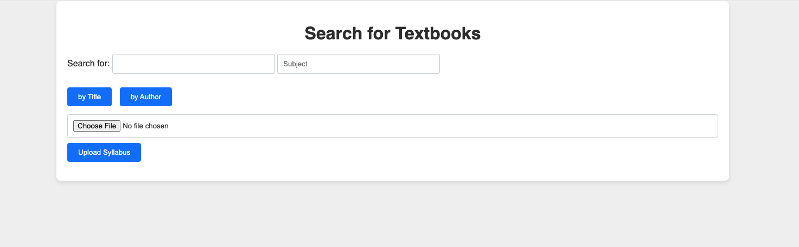
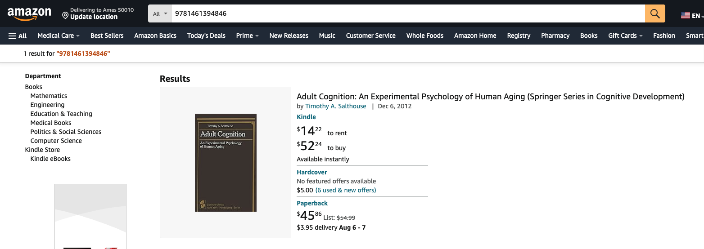

# OpenAI API Textbook Search - User Guide

The OpenAI API Textbook app is a simple tool designed for finding textbooks, uploading PDF syllabi, extracting textbook information using OpenAI's GPT-3, and presenting a list of results. It can be used for simplified textbook searches with an easy-to-use interface, automated textbook extraction when given course syllabi, and to streamline workflow for educators, students and researchers. In addition, the tool can be used to read textbooks on an eReader or purchase the textbooks on Google Play or Amazon.

This guide establishes how to set up the app and provides instructions on how to use it. It is important that the repository has already been downloaded or cloned to your local machine. NOTE: the provided instructions are for macOS.

- OpenAI API: https://openai.com/api/

## Setting Up the Application: 

### Configure API Key:

  1. Obtain OpenAI API key: sign up for OpenAI API access at OpenAI: https://beta.openai.com/signup/. After signing up, you'll receive an API key under 'Your profile' in the top right of the page, then User API keys.

  2. Select '+ Create new secret key'. Copy your new key.

  3. Next, create a python file in the project root directory called 'api_key.py' with the following context:
    - openai_api_key = "your_openai_api_key_here" (Replace 'your_openai_api_key_here' with your actual OpenAI API key).
  
  **NOTE:** **Do not share your API key with anyone.** It can be misused if shared or stolen.

### Install required packages (Python 3.x):

  In a terminal (macOS menu bar > terminal > new terminal), run the following commands:

  1. 'pip install Flask --upgrade'
  2. 'pip install requests --upgrade'
  3. 'pip install jinja2 --upgrade'
  4. 'pip install pdfminer.six --upgrade'
  5. 'pip install openai --upgrade'
  6. 'pip install werkzeug --upgrade'

## Running the Application:

### Run the Flask application (VS Code)

  To access the application, go to the main.py file in the project's root folder.

  1. Once in main.py, select 'Run' in the top menu bar, then 'Run Without Debugging'.
  
  2. In the terminal, command click 'http://127.0.0.1:5000' or open your web browser and go to 'http://127.0.0.1:5000' to access the application.

## Using the Application:

1. ### Search for textbooks:

  - On the main page, enter search parameters for the desired textbook (title, author, subject, ISBN) and submit the search form.
  - The application will display search results based on the entered criteria.

  

  

  

2. ### View eBook:

  - Click the blue link, 'Open Ebook', to view detailed information.
  - The application will open a new HTML page with the eBook in your default web browser.
    - Possible error: the textbook selected does not have an eBook option.
  
  

3. ### View Google Play:

  - Click the blue link, 'View on Google Play', to view detailed information.
  - The application will open a new HTML page with the eBook in your default web browser.
    - Possible error: the textbook selected does not have the option for Google Play.
  
  

4. ### View Amazon:

  - Click the blue link, 'View on Amazon', to view detailed information.
  - The application will open a new HTML page with the eBook in your default web browser.
    - Possible error: the textbook selected does not have the option to purchase on Amazon.

  

5. ### Upload a syllabus:

  - Back on the main page, select the 'Choose File' button to pull a syllabus from local files. Once selected, click 'Upload Syllabus'.
  - The application will proccess the PDF, extract textbook information, and display the results.

  

  

## User Interaction Summary

1. Landing on the search page: the user lands on the main search page where they can search for textbooks or upload a syllabus.
2. Performing a search: the user submits search parameters (subject, title, and/or author) to find textbooks.
3. Viewing search results: the search results are displayed to the user.
4. Opening a textbook: the user can view details of a selected book in the browser (eBook, Google Play, Amazon)
5. Uploading a syllabus: the user uploads a PDF syllabus for textbook extraction.
6. Viewing textbook information: the extracted textbook information is displayed based on the syllabus.

## Possible Bugs

- Unable to search for selected textbook after syllabus upload; no results found
  - Potential fix: Searching for the textbook(s) by title or author

- Separate tab for eBook, Google Play, Amazon
  - Potential fix: The user must close out of the additional tab

- No results based on search parameters
  - Potential fix: Try new search parameters