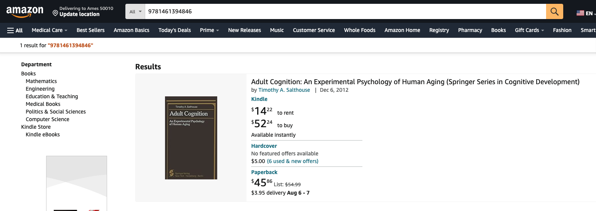

# Google/OpenAI API Textbook Search - Developer's Guide

This guide explains the backend of the application for developers. It describes its key components, install/deployment/admin issues, detailed flow walkthrough and code involvement, minor and major known issues, and future work. Note: this application has many opportunities for improvement and added features.

## Overview
This application is a web-based tool designed for users to search for textbooks by subject, title, or author. It uses the Google Books API to search for textbooks based on user queries, and is also designed for uploading PDF syllabi, extracting textbook information using OpenAI's GPT-3, and presenting the results to the user. It leverages Flask for web server management, Jinja2 for templating, and PDFMinder for PDF text extraction. The application also integrates with the OpenAI API to analyze and process the text from the syllabus.

## Key Components

- Flask Web Framework
    - Manages HTTP requests and responses, routes URLs to appropriate functions, and serves HTML templates.
- Jinja2 Templating
    - Used for rendering HTML templates dynamically based on context data.
- PDFMiner
    - Extracts text from PDF files uploaded by users.
- OpenAI API
    - Provides AI-based analysis to extract textbook information from syllabus text.
- Werkzeug
    - Provides utilities for file handling, such as securing file names.

## Directory Structure

- Google-Books-API-Textbook-Search_amandahallman

    - /ebooks
        - google_ebook_reader_template.html     (Jinja2 template for rendering ebook pages)

    - /uploads
        - [uploaded PDF files]                  (Directory where uploaded files will be saved)

    - /static
        - /css                                  (Directory for CSS files)

    - /old                                      (Folder containing old files/folders for reference)                                   

    - /templates
        - search_w_autocomplete.html            (Template for the main search page with autocomplete)
        - results.html                          (Template for displaying search results)
        - upload_syllabus.html                  (Template for the syllabus upload page)
        - syllabus_results.html                 (Template for displaying extracted textbook info)

    - get_ebooks_function.py                    (Script with the 'get_books' function; Google API)
    - api_key.py                                (File containing the OpenAI API key)
    - main.py                                   (Main application script)
    - bugs.txt                                  (File listing possible bugs)

## Install/Deployment/Admin Issues

1. Environmental Variables: ensure that 'api_key.py' is properly configured with YOUR OpenAI API key.
    - Example: openai_api_key = "your_openai_api_key_here"

2. File Permissions and Uploads: ensure that the '/uploads' directory exists and has the appropriate permissions for file uploads.

3. Security: ensure that sensitive information (i.e., API keys, credentials) is not exposed.

## User Interaction and Flow Walkthrough

1. Landing on the search page: the user lands on the main search page where they can search for textbooks or upload a syllabus.
2. Performing a search: the user submits search parameters (subject, title, and/or author) to find textbooks.
3. Viewing search results: the search results are displayed to the user.
4. Opening a textbook: the user can view details of a selected book in the browser (eBook, Google Play, Amazon)
5. Uploading a syllabus: the user uploads a PDF syllabus for textbook extraction.
6. Viewing textbook information: the extracted textbook information is displayed based on the syllabus. 

## Detailed Flow and Code Involvement

### Landing on the search page
- User Action: the user navigates to the rool URL ('/').
- Code Involvement:
    - Function: `index()` (located in the main module)
        - Handles GET requests to render the `search_w_autocomplete.html` template, which includes a form for users to enter search criteria and perform textbook searches

### Performing a search
- User Action: the user submits a search form with parameters for search term, type, authors, subject, or ISBN. 
- Code Involvement:
    - Function: `perform_search()` (located in the main module)
        - Handles POST requests to /search. Constructs a query based on the form data and calls `get_books()` from `get_ebooks_function.py` to fetch book data.
    - Function: `get_books(query)` (located in get_ebooks_function.py)
        - Fetches book data based on the constructed query. The results are passed to the results.html template.

### Viewing search results:
- User Action: the user views the search results displayed on the results page.
- Code Involvement:
    - Template: `results.html`
        - Renders the book search results based on the data received from the `perform_search()` function.

### Opening a textbook:
- User Action: the user clicks on a link to open an eBook, Google Play, or Amazon
- Code Involvement:
    - Function: `open_ebook(isbn, subject, author)` (located in the main module)
    - Template: `google_ebook_reader_template.html` (loaded from the `ebooks` directory)
        - Handles GET requests to /open_ebook/<isbn>/<subject>/<author>. Renders the `google_ebook_reader_template.html` template using Jinja2 and opens it in the browser.

### Uploading a syllabus:
- User Action: the user uploads a PDF syllabus file.
- Code Involvement:
    - Function: `upload_syllabus()` (located in the main module)
        - Handles both GET and POST requests to /upload_syllabus. For POST requests, it saves the uploaded PDF, extracts text using `process_syllabus()`, and then calls `extract_textbooks_info()` to get textbook data.
    - Function: `process_syllabus(pdf)` (located in the main module)
        - Extracts and cleans text from the uploaded PDF.
    - Function: `extract_textbooks_info(syllabus_text)` (located in the main module)
        - Uses OpenAI's GPT-3 model to extract textbook information from the syllabus text. It returns a list of dictionaries with textbook details or an error message.

### Viewing textbook information:
- User Action: the users views the extracted textbook information from the syllabus.
- Code Involvement:
    - Template: `syllabus_results.html`
        - Displays the extracted textbook information based on the data provided by extract_textbooks_info().

## Known Issues

### Minor Issues:

- The path to the Jinja2 template (`ebooks` directory) is hardcoded in the `open_ebook` function.
    - May cause issues if the directory structure changes or if the application is deployed in a different environment where the path differs.
- The form inputs for the textbook search and syllabus upload are not validated on the client side.
    - Users might be able to submit invalid or incomplete data, leading to potential errors.

### Major Issues:

- The file handling in `upload_syllabus()` assumes that the uploaded file will always be a valid PDF and that the `process_syllabus` function will not fail.
    - If the file is corrupted or not a valid PDF, the application may crash or behave unexpectedly.
- The OpenAI API key is hardcoded and retrieved from `api_key.py`.
    - Hardcoding sensitive information can lead to security vulnerabilities if the code is exposed or shared.
- The `process_syllabus()` function might experience performance issues or timeouts when processing very large PDF files.
    - Users with large syllabi may encounter slow performance or failed uploads.
- The `open_ebook()` function opens the ebook in the user's default web browser using a file URL.
    - This approach may not work consistently across all browsers or operating systensm and might lead to issues with local file access permissions.
- The application lacks user feedback mechanisms for certain actions (e.g., file upload success/failure, search results).
    - Users may be confused if actions do not provide visible feedback or if something goes wrong. 

## Future Work

- Improve the overall design and usability of the web application. This could include more intuitive layouts and colors, better navigation, and responsive design for different devices. The GUI of this application is very bare minimum.
- Extend the search functionality to include advanced filters such as publication date, language, or book format. Possibly extend the search functionality to include university and course database.
- Add support for additional book APIs and databases, such as Open Library, Google, etc. 
- Implement user authentication to allow users to create accounts, save their search history, and manage their required course textbooks. Possibly implement university-specific profiles.
- Optimize the file handling and processing logic, especially for large PDF files, to enhance performance and reduce processing times.
- Provide comprehensive API documentation for any external services or integrations used in the application. Further documentation on coding process.

